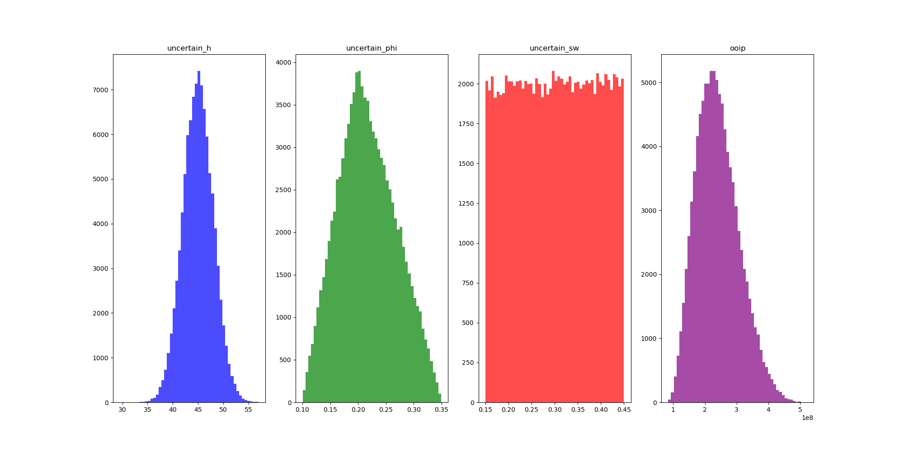

# Monte Carlo Simulation for Reservoir OOIP Estimation

## Overview
This project applies Monte Carlo simulation to estimate Original Oil in Place (OOIP) under uncertainty.

## Objectives
- Model uncertainty in reservoir parameters  
- Estimate OOIP using probabilistic methods  
- Quantify uncertainty using P10, P50, and P90 values  

## Tools & Technologies
- Python  
- NumPy  
- Pandas  
- Matplotlib  

## Sample Output

### Histogram of Simulation Results

## Key Features
- Random sampling using multiple probability distributions  
- Large-scale simulation (100,000 cases)  
- OOIP calculation under uncertainty  
- Export of simulation dataset  

## Key Insights
- OOIP varies significantly under uncertainty  
- Porosity and water saturation strongly influence results  
- P10, P50, and P90 provide a probabilistic range for decision-making  

## Data
The dataset is generated through simulation and included in the outputs folder.
